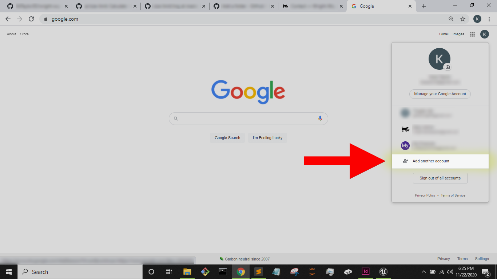

# 

Shelter link - https://wright-wayrescue.org/
# Wright-WayRequests
Use of Python to scrape a Chicago, IL based animal rescue. Sends new/available animals via smtp.google server. Then documents animals with SQL.
# The Point
This projects is to create a place to practice working on issues. The scope is small but if anyone gets any use out of it that would be cool too.
# Setup
## Create gmail account
_Creating a new gmail is just a safety precaution_
* Go to https://www.google.com/
* Click the circular icon in the top_right corner
* Click 'Add another account'
# 

* Click 'Create account' and then click 'For myself'
# 

* From here fill out the information and press 'Next'
# 

* You will be asked to verify your phone number
* And agree to Privacy and Terms
_Now your account is created_
## Finish setting up your account
_Some settings will need to be changed to get your account ready to use smtp_
* Go to 'Manage your account'
# 

* From here click on 'Security' and scroll down to the 'Signing in to Google'
* Now click on '2-Step Verification'
# 

* You will be prompted to sign-in again
* Follow the three steps of phone verification and then go back to 'Manage your account'
* Head back to the 'Security' tab and then go to 'App passwords'
# 

* Google will prompt you to sign-in again and use another phone verification code
* Once that's finished use the drop down menus to select app and device
_The App should be Mail and the device can be whatever you are using_
# 

* Click 'GENERATE' and you will be given your App Password
# 

_Save this somewhere you will need it later_
