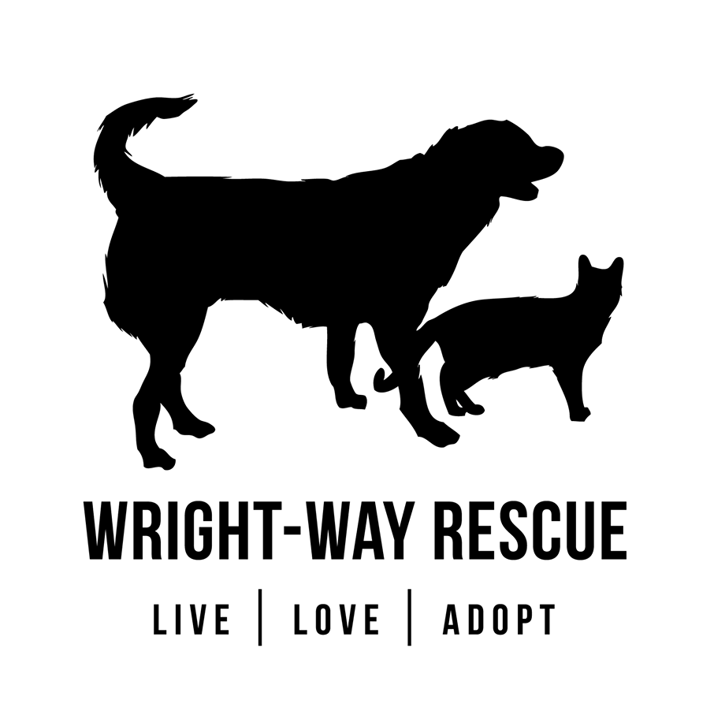

# 

# Wright-WayRequests
Use of Python to scrape a Chicago, IL based animal rescue. Sends new/available animals via smtp.google server. Then documents animals with SQL.
# Setup
## Create gmail account
_Creating a new gmail is just a safety precaution_
* Go to https://www.google.com/
* Click the circular icon in the top_right corner
* Click 'Add another account'
# 

* Click 'Create account' and then click 'For myself'
# 

* From here fill out the information and press 'Next'
# 

* You will be asked to verify your phone number
* And agree to Privacy and Terms
## Finish setting up our account
_Some settings will need to be changed to get your account ready to use smtp_
